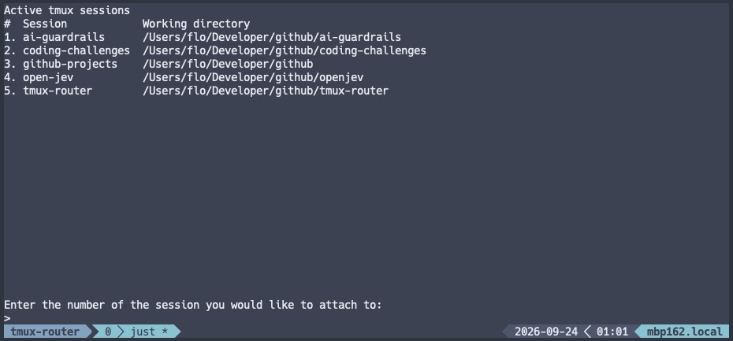

# tmux-router

## About

An interactive tmux session picker for quickly switching between sessions and returning to the menu with F1.



## Installation

Requires macOS or Linux, Python 3.12+, `tmux`, `uv`, and `just`.

From the project directory, install the dependencies:

```sh
uv sync --all-extras
```

## How-To-Use

Launch in a new tmux session named `tmux-router`:

```sh
just run-tmux
```

This attaches to the new session, or switches to it if you are already inside
tmux. If `tmux-router` already exists, it exits with code 1 without changing
that session.

To run directly in your current terminal instead:

```sh
just run
```

- Enter a session number and press **Enter** to attach.
- Press **F1** to return to the picker, leaving the session running.
- Press **Ctrl-C** in the picker to quit.
- Use **Up/Down** to scroll. The list refreshes every 10 seconds while the input is empty.

Create your working sessions with tmux first. The picker lists sessions on the
current tmux server and cannot attach to the session containing the router.
